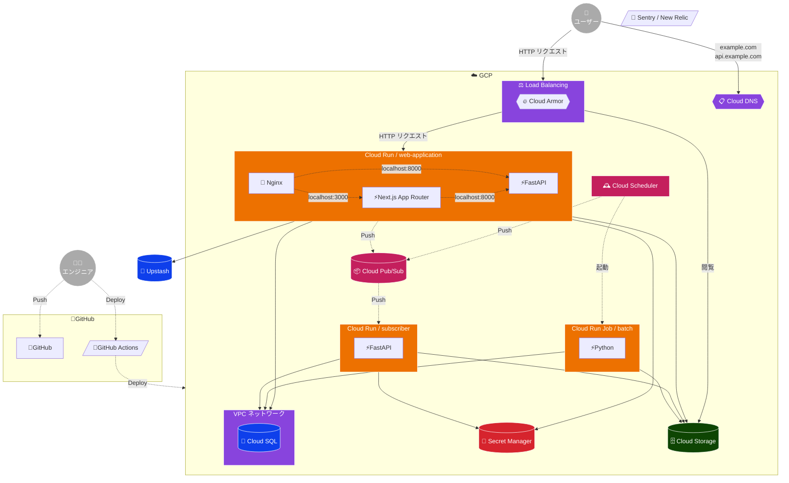

# 🛠️ システムアーキテクチャ

 - [Nginx を使用したフロントエンド プロキシ  |  Cloud Run Documentation  |  Google Cloud](https://cloud.google.com/run/docs/internet-proxy-nginx-sidecar?hl=ja)
 - [外部アプリケーション ロードバランサの概要  |  Load Balancing  |  Google Cloud](https://cloud.google.com/load-balancing/docs/https?hl=ja)

## ☁️ GCP

